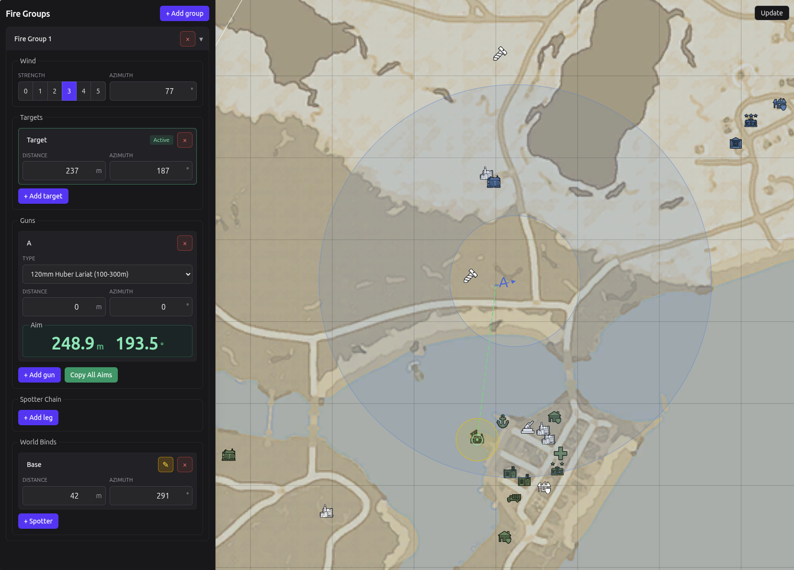

# Foxhole Artillery Calculator

This is a small, personal project I did for a few of my friends in a video game called Foxhole in 2025. It is a browser-based artillery calculator that uniquely features multi-gun support, spotter-chaining and fire-control groups for easier coordination. It combines an interactive world map with artillery calculations so a group can manage guns, spotters, targets, test their range limits for various vehicles/guns, view dispersion and wind compensation from one interface.

- Displays the Foxhole world map and current public map data from the official War API with efficient caching
- Supports multiple fire groups, guns, targets, and chained spotter positions
- Binds base and spotter positions to live map locations
- Calculates range and azimuth for each gun against the selected target
- Applies weapon-specific range, inaccuracy, and wind effects to the firing solution
- Visualizes firing geometry, range limits, aim points, and dispersion on the map
- Persists the current setup in browser local storage
- Provides optional Discord OAuth and role-based access control for hosted deployments
- Includes Docker configurations for development and production deployment



## Stack

- React/TypeScript/MobX
- Vite
- Tailwind CSS
- Node.js
- Express
- Discord OAuth
- Docker

## Discord access control

Discord authentication is optional, but was used to keep it within our group and team. When enabled, the server uses Discord OAuth to identify the user and verifies membership in a configured guild role before allowing access to the application. Although there's nothing you can really do from stopping someone from downloading the full source once they're logged in, I did some simple server-side data endpoints to at least make it more annoying.

The following environment variables are used:

```text
SESSION_SECRET
COOKIE_SECURE
DISCORD_AUTH_DISABLED
DISCORD_CLIENT_ID
DISCORD_CLIENT_SECRET
DISCORD_REDIRECT_URI
DISCORD_GUILD_ID
DISCORD_REQUIRED_ROLE_ID
DISCORD_BOT_TOKEN
```

## Foxhole data and assets

The application uses the public Foxhole War API for live map data. Foxhole's map artwork, icons, names, and other game assets are property of Siege Camp. The game assets under `client/public/tiles` and `client/public/icons` are not covered by this repository's MIT license. See `THIRD_PARTY_ASSETS.md` for details.
